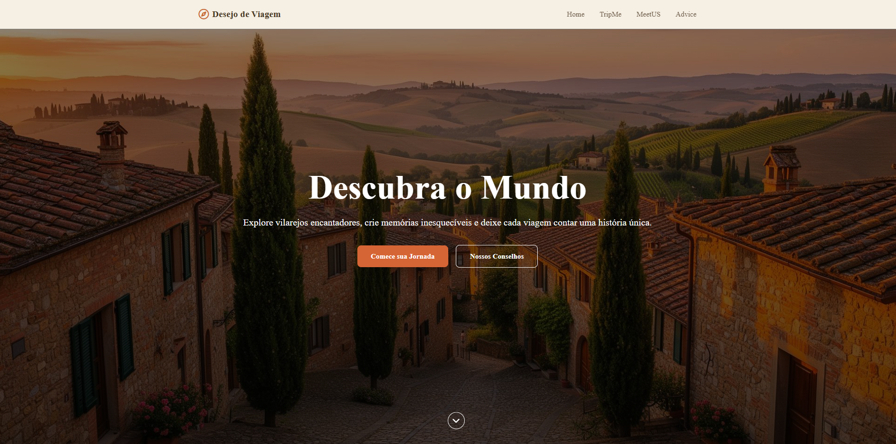
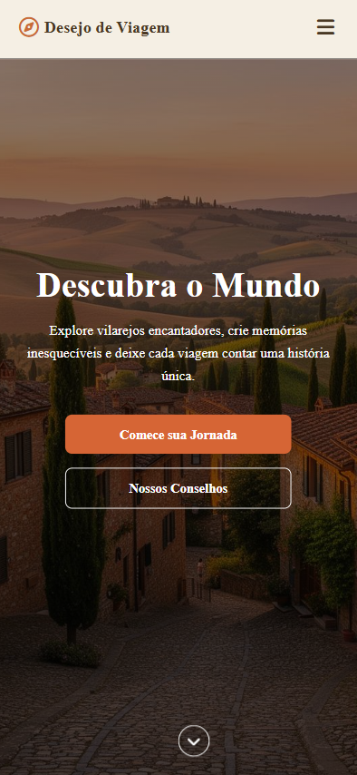
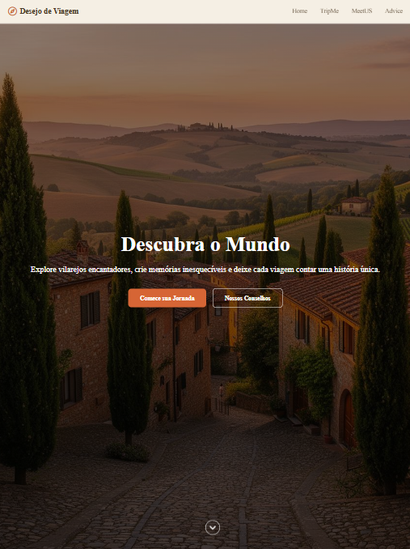

<h1 align="center">Desejo de Viagem - Landing Page de Viagens</h1>

<p align="center">
  Uma landing page moderna e responsiva para uma agência de viagens fictícia, focada em destinos europeus encantadores. Desenvolvida como projeto prático de HTML, CSS e JavaScript.
</p>

<p align="center">
  
  
  
</p>

### 📋 Sobre o Projeto

Desejo de Viagem é uma landing page completa que apresenta destinos de viagem, equipe de especialistas e dicas valiosas para viajantes. O projeto foi desenvolvido com foco em:

- ✅ Semântica HTML5
- ✅ Design responsivo (mobile-first)
- ✅ Acessibilidade web (WCAG)
- ✅ Navegação interna suave
- ✅ Animações e transições CSS

### 🎯 Funcionalidades

- **Hero/Banner Principal**: Imagem de fundo impactante com texto sobreposto e call-to-action
- **Menu Responsivo**: Navegação mobile com hamburguer menu
- **Seção TripMe**: Apresentação de destinos populares com cards interativos
- **Seção MeetUs**: Equipe de especialistas e estatísticas da empresa
- **Seção Advice**: Dicas práticas para viajantes
- **Footer Completo**: Informações de contato, redes sociais e navegação
- **Navegação Interna**: Links "voltar ao topo" em todas as seções
- **Efeitos Hover**: Feedback visual em todos os elementos interativos

### 🚀 Tecnologias Utilizadas

- **HTML5**: Estrutura semântica
- **CSS3**: Estilização e animações
  - Flexbox & Grid Layout
  - Media Queries
  - Transitions & Animations
  - Custom Properties (variáveis CSS)
- **JavaScript (Vanilla)**: Interatividade do menu mobile
- **Font Awesome**: Ícones

### 📁 Estrutura do Projeto
```
desejo-de-viagem/
│
├── index.html
│
├── src/
│   ├── styles/
│   │   ├──vendor/
│   │   │   ├── reset.css
│   │   ├── global.css
│   │   ├── header.css
│   │   ├── hero.css
│   │   ├── tripme.css
│   │   ├── meetus.css
│   │   ├── advice.css
│   │   └── footer.css
│   │
│   ├── scripts/
│   │   └── toggle.js
│   │
│   └── assets/
│       └── images/
│           ├── hero-village.jpg
│           ├── cafe-terrace.jpg
│           ├── travelers.jpg
│           └── travel-planning.jpg
│           └── favicon.svg
│
└── README.md
```

### 💻 Como Executar

1. **Clone o repositório**
```bash
git clone https://github.com/henrymzs/viagens--landing-page.git
```

2. **Abra o arquivo `index.html` no navegador**
   - Duplo clique no arquivo, ou
   - Use um servidor local (Live Server, http-server, etc.)

**Recomendado**: Use a extensão [Live Server](https://marketplace.visualstudio.com/items?itemName=ritwickdey.LiveServer) do VS Code para melhor experiência de desenvolvimento.

### 📱 Responsividade

O projeto é totalmente responsivo e foi testado nos seguintes breakpoints:

- **Mobile**: < 600px
- **Tablet**: 600px - 991px
- **Desktop**: ≥ 992px

### 📸 Screenshots

### Desktop


### Mobile Padrão


### Mobile Menores


### Tablet



### 👤 Autor

**Henry**

- GitHub: [@henrymzs](https://github.com/henrymzs)
- LinkedIn: [henry-kaua](https://linkedin.com/in/henry-kaua/)
- Email: henrykaua21@gmail.com

⭐ **Se este projeto te ajudou, considere dar uma estrela!**
